## 👋 Hi!

🎓 I'm a **Computer Science and Engineering** student at the **University of Bologna (Unibo)**, Cesena Campus.  

---

## 🚀 About Me

👨🏻‍💻I’m currently studying Computer Science and Engineering at University of Bologna. 
Alongside my studies, I work as a tutor, helping middle and high school students with homework and study support.  

---

## 📊 GitHub Stats

  

  

---

## 🛠️ Languages & Technologies

### 💻 Programming Languages:

  
  
  
         
  
  

### 🌐 Web Development:

  
  
  
  
  
  
  
  
  

### ⚙️ Hardware & IoT:

  
  
  
  
  

### 🧰 Tools & Version Control:

  
  
     
  
  
          

---

✨ *Thanks for visiting my profile!*
